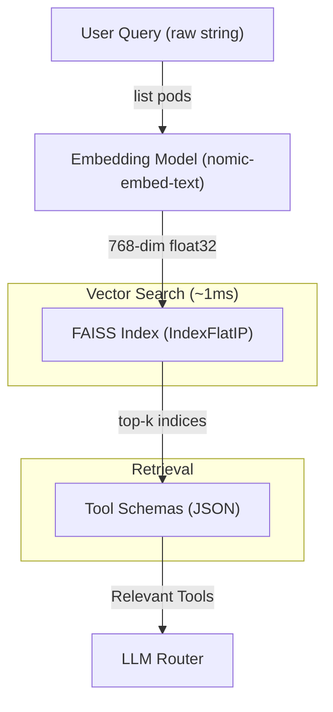

# RAG Tool Index - FAISS-Powered Retrieval

> **Retrieval-Augmented Generation (RAG)** for intelligent tool selection using Facebook AI Similarity Search (FAISS).

High-performance vector similarity search that enables the DevOps Agent to select the most relevant tools for any natural language query with sub-millisecond latency.

---

## Table of Contents

1. [Architecture](#architecture)
2. [How It Works](#how-it-works)
3. [Files Overview](#files-overview)
4. [Quick Start](#quick-start)
5. [CLI Commands Reference](#cli-commands-reference)
6. [Auto-Indexing (Dynamic Tool Discovery)](#auto-indexing-dynamic-tool-discovery)
7. [Data Files](#data-files)
8. [Performance](#performance)
9. [Troubleshooting](#troubleshooting)
10. [Integration with Intent Router](#integration-with-intent-router)
11. [GPU Upgrade Guide](#gpu-upgrade-guide)
12. [Technical Deep Dive](#technical-deep-dive)

---

## Architecture



---

## How It Works

### Embedding Generation

Each tool is converted to a dense vector representation:

```python
# Tool schema
{
    "name": "remote_k8s_list_pods",
    "description": "List all pods in a namespace on the remote K8s cluster"
}

# Embedding text (concatenated)
"remote_k8s_list_pods: List all pods in a namespace on the remote K8s cluster"

# Generated embedding (768-dimensional)
[0.0234, -0.1567, 0.0891, ..., 0.0456]  # 768 floats
```

### Similarity Search

FAISS uses **Inner Product (IP)** similarity on L2-normalized vectors, which is mathematically equivalent to **cosine similarity**:

```
similarity(query, tool) = dot(normalize(query_emb), normalize(tool_emb))
```

This produces scores in [-1, 1] where:
- **1.0** = Identical meaning
- **0.0** = Unrelated
- **-1.0** = Opposite meaning

---

## Files Overview

| File | Purpose | Key Functions |
|------|---------|---------------|
| `faiss_index.py` | FAISS index manager | `add()`, `remove()`, `search()`, `verify()` |
| `tool_retriever.py` | Query interface | `retrieve(query, top_k)` |
| `README_RAG.md` | This documentation | - |

### `faiss_index.py`

Core FAISS index manager with:
- **GPU auto-detection**: Uses GPU if `faiss-gpu` installed
- **Atomic saves**: Temp file + rename to prevent corruption
- **File locking**: Thread-safe concurrent access
- **Metadata management**: Bidirectional tool↔index mapping

```python
from devops_agent.rag.faiss_index import get_faiss_index

index = get_faiss_index()
index.add("my_tool", embedding_vector, "Tool description")
results = index.search(query_embedding, top_k=5)
# Returns: [("tool_name", 0.95), ("other_tool", 0.82), ...]
```

### `tool_retriever.py`

High-level retrieval interface with:
- **LRU caching**: 256-entry cache for query embeddings
- **FAISS + JSON fallback**: Uses JSON if FAISS unavailable
- **Auto-sync**: Populates index on first load

```python
from devops_agent.rag.tool_retriever import get_retriever

retriever = get_retriever()
# NEW: Async API for non-blocking UI
tools = await retriever.retrieve("show me kubernetes deployments", top_k=8)
# Returns: List of tool schema dicts
```

---

## Quick Start

```bash
# View all indexed tools
devops-agent rag list

# Check index health
devops-agent rag verify

# Rebuild from scratch (regenerate all embeddings)
devops-agent rag rebuild

# Get info about a specific tool
devops-agent rag info docker_list_containers
```

---

## CLI Commands Reference

### `devops-agent rag list`

Display all indexed tools with their FAISS indices.

**Output:**
```
📋 FAISS Index (25 tools):

  [  0] docker_list_containers
        └─ List all Docker containers...
  [  1] docker_run_container
        └─ Run a new Docker container...
  [  2] docker_stop_container
        └─ Stop a running Docker container...
  ...
```

---

### `devops-agent rag info <tool_name>`

Show detailed information about a specific tool's embedding.

**Usage:**
```bash
devops-agent rag info remote_k8s_list_pods
```

**Output:**
```
🔍 Tool: remote_k8s_list_pods
   Index: 12
   Description: List pods in a namespace on the remote cluster
   Indexed: ✅
```

---

### `devops-agent rag remove <tool_name>`

Remove a specific tool from the index.

**Usage:**
```bash
devops-agent rag remove deprecated_old_tool
```

**Output:**
```
✅ Removed 'deprecated_old_tool' from FAISS index.
   ⚠️  Run 'devops-agent rag rebuild' to regenerate a clean index.
```

> **Note:** FAISS `IndexFlat` doesn't support in-place deletion. The tool is marked as removed in metadata, but a full rebuild is recommended.

---

### `devops-agent rag clear --force`

Delete **ALL** embeddings from the FAISS index.

**Usage:**
```bash
devops-agent rag clear           # Prompts for confirmation
devops-agent rag clear --force   # Skips confirmation
```

**Output:**
```
✅ FAISS index cleared.
```

---

### `devops-agent rag rebuild`

Regenerate the entire FAISS index from scratch.

**Usage:**
```bash
devops-agent rag rebuild
```

**Output:**
```
🔄 Rebuilding FAISS index from scratch...
   Found 25 tools
   ✅ docker_list_containers
   ✅ docker_run_container
   ✅ docker_stop_container
   ✅ chat
   ✅ local_k8s_list_pods
   ✅ local_k8s_list_nodes
   ...
✅ Rebuilt FAISS index with 25/25 tools
```

**Duration:** ~30 seconds (depends on embedding model speed)

---

### `devops-agent rag verify`

Check index consistency and health.

**Usage:**
```bash
devops-agent rag verify
```

**Output (Healthy):**
```
✅ FAISS Index Health: GOOD
   Tools indexed: 25
   FAISS vectors: 25
```

**Output (Issues):**
```
⚠️  FAISS Index Health: ISSUES FOUND
   Tools indexed: 25
   FAISS vectors: 23

❌ Issues:
   • Index size mismatch: 23 vs 25
```

---

## Auto-Indexing (Dynamic Tool Discovery)

New tools are **automatically indexed** at startup via `tool_indexer.py`.

### The Sync Process

```
┌──────────────────────────────────────────────────────────────┐
│                    sync_tool_index()                         │
├──────────────────────────────────────────────────────────────┤
│                                                              │
│  1. Discover Tools                                           │
│     └─ Scan Docker + K8s registries                          │
│                                                              │
│  2. Load Existing Embeddings                                 │
│     └─ From tool_embeddings.json                             │
│                                                              │
│  3. Find Missing Tools                                       │
│     └─ Compare registered vs indexed                         │
│                                                              │
│  4. Generate Embeddings (only for new tools)                 │
│     └─ Call nomic-embed-text via Ollama                      │
│                                                              │
│  5. Save to JSON Cache                                       │
│     └─ tool_embeddings.json                                  │
│                                                              │
│  6. Sync to FAISS Index                                      │
│     └─ faiss_index.add() for each new tool                   │
│                                                              │
│  7. Generate Auto-Templates                                  │
│     └─ Infer regex patterns from tool names                  │
│                                                              │
└──────────────────────────────────────────────────────────────┘
```

### Adding a New Tool

**Step 1:** Create your tool class

```python
# devops_agent/tools/my_new_tool.py
from .base import Tool
from .registry import register_tool

@register_tool
class MyNewTool(Tool):
    name = "my_new_tool"
    description = "Does something amazing for DevOps"
    
    def get_parameters_schema(self):
        return {
            "type": "object",
            "properties": {
                "target": {"type": "string", "description": "Target resource"}
            },
            "required": ["target"]
        }
    
    def run(self, target: str = None, **kwargs):
        # Your implementation
        return {"success": True, "result": f"Processed {target}"}
```

**Step 2:** Import in `__init__.py`

```python
# devops_agent/tools/__init__.py
from .my_new_tool import MyNewTool
```

**Step 3:** Start the agent (auto-indexes)

```bash
devops-agent start-all
```

**Step 4:** Verify indexing

```bash
devops-agent rag info my_new_tool
# 🔍 Tool: my_new_tool
#    Index: 25
#    Description: Does something amazing for DevOps
#    Indexed: ✅
```

---

## Data Files

| File | Location | Format | Description |
|------|----------|--------|-------------|
| `faiss_index.bin` | `data/` | Binary | FAISS index vectors |
| `faiss_metadata.json` | `data/` | JSON | Tool↔index mapping |
| `tool_embeddings.json` | `data/` | JSON | Backup embeddings |
| `faiss.lock` | `data/` | Lock | Concurrent access guard |

### faiss_metadata.json Structure

```json
{
  "tools": {
    "docker_list_containers": {
      "idx": 0,
      "description": "List all Docker containers..."
    },
    "docker_run_container": {
      "idx": 1,
      "description": "Run a new Docker container..."
    }
  },
  "idx_to_tool": {
    "0": "docker_list_containers",
    "1": "docker_run_container"
  }
}
```

### View Raw Metadata

```bash
# Windows
type devops_agent\data\faiss_metadata.json

# Linux/macOS
cat devops_agent/data/faiss_metadata.json
```

---

## Performance

### Latency Breakdown

| Operation | Latency | Cached | Notes |
|-----------|---------|--------|-------|
| Query embedding (Async) | ~20ms | ✅ LRU (256) | nomic-embed direct call |
| FAISS search (25 tools) | ~1ms | ❌ | IndexFlatIP |
| Parallel Gathering | ~2ms | ❌ | asyncio.gather overhead |
| Total Pipeline | ~25ms | - | Sub-millisecond if cached |

### Memory Usage

| Tools | Index Size | RAM |
|-------|------------|-----|
| 25 | ~75KB | ~100KB |
| 200 | ~600KB | ~800KB |
| 1000 | ~3MB | ~4MB |

### Query Caching

The LRU cache stores the 256 most recent query embeddings:

```python
@lru_cache(maxsize=256)
def _cached_query_embedding(query: str) -> Tuple[float, ...]:
    """Cache query embeddings."""
    emb = get_embeddings(query)
    return tuple(emb) if emb else ()
```

**Effect:** Repeated identical queries skip the ~50ms embedding call.

---

## Troubleshooting

### "FAISS not installed"

```bash
# CPU version (works everywhere)
pip install faiss-cpu

# GPU version (Linux only via pip)
pip install faiss-gpu
```

### "Index size mismatch"

**Cause:** Index corrupted or incomplete sync.

**Fix:**
```bash
devops-agent rag rebuild
```

### "Tool not found in index"

**Cause:** Tool added after last sync.

**Fix:**
```bash
# Check if tool exists
devops-agent rag list | findstr <tool_name>

# If not found, rebuild
devops-agent rag rebuild
```

### "Index file corrupted"

**Cause:** Interrupted write or disk error.

**Fix:**
```bash
# Clear and rebuild
devops-agent rag clear --force
devops-agent rag rebuild
```

### "Embedding generation failed"

**Cause:** Ollama not running or embedding model not installed.

**Fix:**
```bash
# Check Ollama is running
ollama list

# Pull embedding model
ollama pull nomic-embed-text
```

---

## Integration with Intent Router

FAISS is **Layer 4** in the intent cascade:

```
Query ─┬─► [L1] Keyword ──► Instant Match? ──► Execute (0ms)
       │
       ├─► [L2] Regex ───► Template Match? ──► Extract Args (1ms)
       │
       ├─► [L3] Semantic ─► Embedding Match? ─► High Conf? (50ms)
       │
       └─► [L4] RAG/FAISS ► Top-K Tools ────► LLM Selects (100ms+)
```

**Only reached if no confident match in L1-L3.**

### Layer Responsibilities
 
| Layer | Name | Speed | Accuracy | When Used |
|-------|------|-------|----------|-----------|
| L1 | Keyword | 0ms | 100% | Exact matches like "hi", "help" |
| L2 | Smart Match | 0.5ms | 98% | Instant parameter extraction (namespace, phase) |
| L3 | Semantic | 50ms | 90% | Zero-Shot intent variations |
| L4 | RAG/FAISS | 100ms+ | 85% | Top-k retrieval + LLM Reasoning |
 
> [!TIP]
> **Filtering & Accuracy**: LLM performance in Layer 4 is significantly improved by the new server-side filtering (`limit`, `label_selector`). By returning smaller, focused datasets, the LLM context remains clean, preventing "lost in the middle" errors and refresh loops.

---

## GPU Upgrade Guide

Currently using `faiss-cpu`. GPU acceleration is **automatically enabled** when available.

### Current Status

| Platform | GPU Support | Package |
|----------|-------------|---------|
| Windows | ❌ Not on PyPI | Use Conda or WSL |
| Linux | ✅ Available | `pip install faiss-gpu` |
| macOS | ❌ No CUDA | Use CPU |

### Option 1: Conda (Windows/Linux)

```bash
# Install Miniconda first: https://docs.conda.io/en/latest/miniconda.html
conda create -n devops-agent python=3.11
conda activate devops-agent
conda install -c conda-forge faiss-gpu cudatoolkit=11.8
```

### Option 2: WSL2 (Windows → Linux)

```bash
# 1. Install WSL2 with Ubuntu
wsl --install -d Ubuntu

# 2. Inside WSL, install CUDA toolkit
sudo apt update
sudo apt install nvidia-cuda-toolkit python3-pip

# 3. Install faiss-gpu
pip install faiss-gpu

# 4. Clone/mount your project
cd /mnt/c/Users/Nayan/Desktop/agentic-docker

# 5. Install dependencies
pip install -e .

# 6. Run agent from WSL
devops-agent start-all
```

### Option 3: Linux Server

```bash
# On a Linux server with NVIDIA GPU + CUDA
pip install faiss-gpu

# The code auto-detects GPU and uses it
python -c "import faiss; print(f'GPUs: {faiss.get_num_gpus()}')"
```

### Verification

After installing GPU-capable FAISS:

```python
import faiss
print(f"GPU available: {faiss.get_num_gpus() > 0}")
```

Or check agent startup logs:
```
🚀 FAISS GPU support detected
🚀 FAISS index moved to GPU
```

### Performance Comparison

| Index Size | CPU | GPU | Speedup |
|------------|-----|-----|---------|
| 25 tools | 1ms | 0.5ms | 2x |
| 200 tools | 2ms | 0.5ms | 4x |
| 1000 tools | 10ms | 0.8ms | 12x |
| 10000 tools | 100ms | 2ms | 50x |

> **Note:** GPU benefits are most significant for large indices (1000+ tools). For your current scale (25-200 tools), CPU is perfectly adequate.

---

## Technical Deep Dive

### Why IndexFlatIP?

We use `faiss.IndexFlatIP` (Inner Product) instead of `IndexFlatL2` (Euclidean) because:

1. **Normalized vectors**: Our embeddings are L2-normalized before adding
2. **Cosine similarity**: IP on normalized vectors = cosine similarity
3. **Score interpretation**: Scores in [0, 1] are intuitive

```python
# In faiss_index.py
emb = np.array([embedding], dtype=np.float32)
faiss.normalize_L2(emb)  # Normalize before adding
self.index.add(emb)
```

### Why Not IVF?

`IndexIVFFlat` would be faster for 10,000+ tools but:
- Requires training on data
- Overkill for <500 tools
- `IndexFlatIP` has guaranteed 100% recall

For our scale (25-200 tools), exact search is fast enough.

### Embedding Model Choice

We use `nomic-embed-text` (via Ollama) because:
- **768 dimensions**: Good balance of quality vs speed
- **Instruction-tuned**: Works well for tool descriptions
- **Local**: No API calls, runs on your hardware

### File Locking

We use `filelock` for thread-safe operations:

```python
from filelock import FileLock

with FileLock(str(self.lock_path)):
    # Atomic save operation
    temp_idx = self.index_path.with_suffix(".tmp")
    faiss.write_index(index, str(temp_idx))
    temp_idx.replace(self.index_path)  # Atomic rename
```

This prevents corruption from concurrent writes.

---

## Changelog

| Version | Date | Changes |
|---------|------|---------|
| 1.0 | 2024-12-23 | Initial FAISS implementation |
| 1.1 | 2024-12-23 | Added CLI commands, auto-sync, GPU docs |
